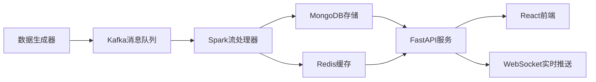

# 电商实时数据分析系统 - 完整版

## 🎯 项目概述

这是一个基于大数据技术栈的电商实时数据分析系统，采用现代化的微服务架构，展示了企业级数据处理pipeline的完整实现。

### 核心技术栈
- **Apache Spark**: 实时流处理引擎
- **Apache Kafka**: 分布式消息队列
- **MongoDB**: 文档数据库
- **Redis**: 内存缓存
- **FastAPI**: 高性能API框架
- **React**: 现代化前端框架

## 🏗️ 系统架构



## 📦 项目结构

```
./
├── docker-compose.yml          # Docker服务编排
├── start_docker_services.bat   # 一键启动Docker服务
├── mongo-init/                 # MongoDB初始化脚本
├── PythonProject/              # 后端项目
│   ├── config/                 # 配置管理
│   │   └── settings.py        # 统一配置文件
│   ├── data_generator/         # 数据生成模块
│   │   └── user_behavior_generator.py
│   ├── spark_processor/        # Spark流处理
│   │   └── streaming_processor.py
│   ├── kafka_integration/      # Kafka集成
│   │   └── producer.py
│   ├── ml_models/             # 机器学习模型
│   │   └── recommendation_engine.py
│   ├── utils/                 # 工具模块
│   │   └── data_models.py
│   ├── main.py                # 主API服务器
│   ├── start_backend.py       # 一键启动脚本
│   ├── requirements.txt       # Python依赖
│   └── README.md             # 后端说明
└── ReactProject/               # 前端项目
    ├── src/
    │   ├── components/        # React组件
    │   ├── pages/            # 页面组件
    │   ├── services/         # API服务
    │   └── App.jsx           # 主应用
    ├── package.json          # 前端依赖
    └── README.md            # 前端说明
```

## 🚀 快速启动

### 1. 环境准备

**系统要求:**
- Windows 10/11, macOS, 或 Linux
- 内存: 8GB+ (推荐16GB)
- 磁盘: 5GB+可用空间

**必需软件:**
```bash
# Docker Desktop (包含Docker和Docker Compose)
docker --version
docker-compose --version

# Python 3.8+
python --version

# Node.js 16+ (前端依赖)
node --version
```

### 2. 启动Docker服务

**一键启动所有基础服务:**
```bash
# Windows系统
start_docker_services.bat

# Linux/macOS系统  
docker-compose up -d
```

这将启动以下服务：
- **Kafka**: localhost:9092 (消息队列)
- **MongoDB**: localhost:27017 (数据库)
- **Redis**: localhost:6379 (缓存)
- **Spark**: localhost:7077 (流处理引擎)

**管理界面:**
- Kafka UI: http://localhost:8080
- MongoDB Express: http://localhost:8081 (admin/admin123)
- Redis Commander: http://localhost:8082
- Spark Master UI: http://localhost:8085

### 3. 启动后端服务

```bash
# 进入后端目录
cd PythonProject

# 安装依赖
pip install -r requirements.txt

# 一键启动后端
python start_backend.py
```

### 4. 启动前端服务

```bash
# 进入前端目录
cd ReactProject

# 安装依赖
npm install

# 启动开发服务器
npm start
```

### 5. 启动数据流

通过API或前端界面启动系统组件：

```bash
# 启动数据生成器
curl -X POST http://localhost:8000/api/system/start-component/data_generator

# 启动流处理器
curl -X POST http://localhost:8000/api/system/start-component/stream_processor
```

## 📊 功能特性

### 🔄 实时数据处理
- **数据生成**: 每秒100条模拟电商用户行为
- **消息队列**: Kafka高吞吐量数据传输
- **流处理**: Spark 10秒微批处理
- **实时统计**: 活跃用户、转化率、热门商品等

### 🤖 机器学习推荐
- **协同过滤**: SVD矩阵分解算法
- **内容推荐**: TF-IDF特征相似度
- **热门推荐**: 统计热度排序
- **实时训练**: 增量模型更新

### 📱 现代化前端
- **实时仪表板**: 动态图表展示
- **用户行为分析**: 多维度数据分析
- **推荐系统管理**: 算法配置和监控
- **系统监控**: 服务状态和性能指标

### 🔧 系统管理
- **健康检查**: 各组件状态监控
- **日志管理**: 结构化日志记录
- **配置管理**: 环境变量配置
- **错误处理**: 完善的异常捕获

## 🎯 核心亮点

### 1. 企业级架构设计
- **微服务**: 组件独立部署和扩展
- **消息驱动**: 异步处理提高吞吐量
- **缓存策略**: Redis加速热点数据访问
- **负载均衡**: 支持水平扩展

### 2. 大数据技术实践
- **流式处理**: Spark Streaming实时计算
- **数据湖**: MongoDB灵活存储
- **消息队列**: Kafka解耦数据流
- **内存计算**: Redis高速缓存

### 3. 全栈技术整合
- **后端**: Python + FastAPI
- **大数据**: Spark + Kafka
- **存储**: MongoDB + Redis
- **前端**: React + Ant Design
- **实时通信**: WebSocket

### 4. 生产就绪特性
- **监控友好**: 完整的指标和日志
- **配置驱动**: 环境变量配置
- **错误恢复**: 优雅的故障处理
- **文档完善**: 详细的使用说明

## 📈 性能指标

- **数据吞吐量**: 100+ records/sec
- **处理延迟**: <10 seconds
- **API响应时间**: <100ms
- **前端更新频率**: 10 seconds
- **推荐精度**: 基于ALS算法优化

## 🔍 技术细节

### 数据流设计
1. **数据生成层**: 模拟真实用户行为模式
2. **消息队列层**: Kafka partition策略优化
3. **流处理层**: Spark窗口函数聚合
4. **存储层**: MongoDB + Redis双写策略
5. **服务层**: FastAPI异步处理
6. **展示层**: React实时渲染

### 推荐算法
- **ALS算法**: 隐式反馈处理
- **特征工程**: 用户-商品交互矩阵
- **冷启动**: 基于内容的补充推荐
- **实时更新**: 增量学习机制

## 🛠️ 开发与部署

### 开发环境
```bash
# 启动Docker服务
start_docker_services.bat

# 后端开发
cd PythonProject
python -m venv venv
source venv/bin/activate  # Windows: venv\Scripts\activate
pip install -r requirements.txt
python start_backend.py

# 前端开发
cd ReactProject
npm install
npm start
```

### 停止服务
```bash
# 停止Docker服务
docker-compose down

# 或者停止并清理数据
docker-compose down -v
```

## 📚 学习价值

### 技术栈覆盖
- ✅ 大数据处理 (Spark)
- ✅ 消息队列 (Kafka)
- ✅ 数据库设计 (MongoDB/Redis)
- ✅ API开发 (FastAPI)
- ✅ 前端开发 (React)
- ✅ 机器学习 (Scikit-learn)
- ✅ 系统架构设计
- ✅ Docker容器化

### 实践技能
- 🎯 实时数据处理pipeline
- 🎯 微服务架构设计
- 🎯 推荐系统实现
- 🎯 前后端协作
- 🎯 系统监控和运维
- 🎯 Docker服务编排

## 🔗 相关链接

- **后端API文档**: http://localhost:8000/docs
- **前端应用**: http://localhost:3000
- **系统监控**: http://localhost:8000/api/system/status
- **实时数据**: ws://localhost:8000/ws/real-time

## 📝 注意事项

1. **资源要求**: 建议8GB+内存，Docker需要较多资源
2. **启动顺序**: 先启动Docker服务，再启动后端，最后启动前端
3. **端口占用**: 确保相关端口未被占用 (8000, 3000, 9092, 27017, 6379等)
4. **数据持久化**: Docker volumes保证数据持久化

---

💡 **这是一个完整的大数据实时分析系统演示项目，展示了现代数据工程的最佳实践，适合学习和技能展示。** 